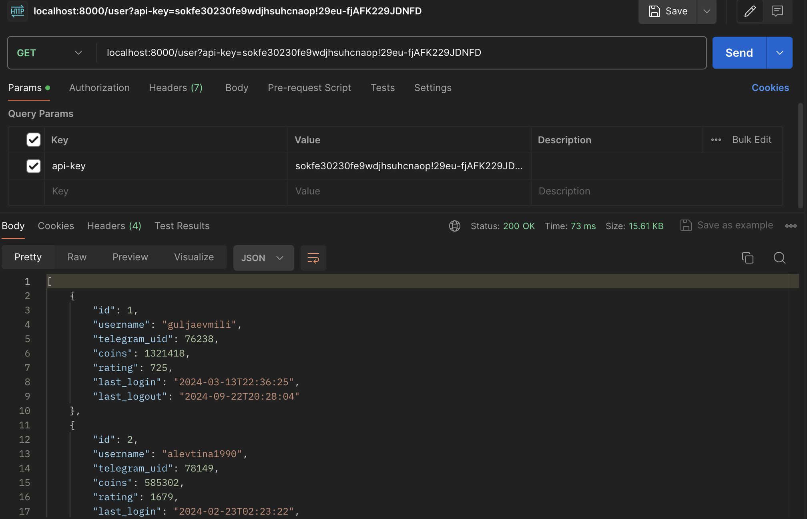
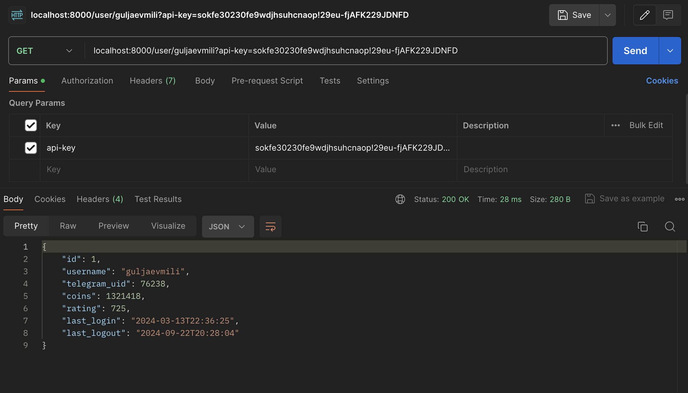
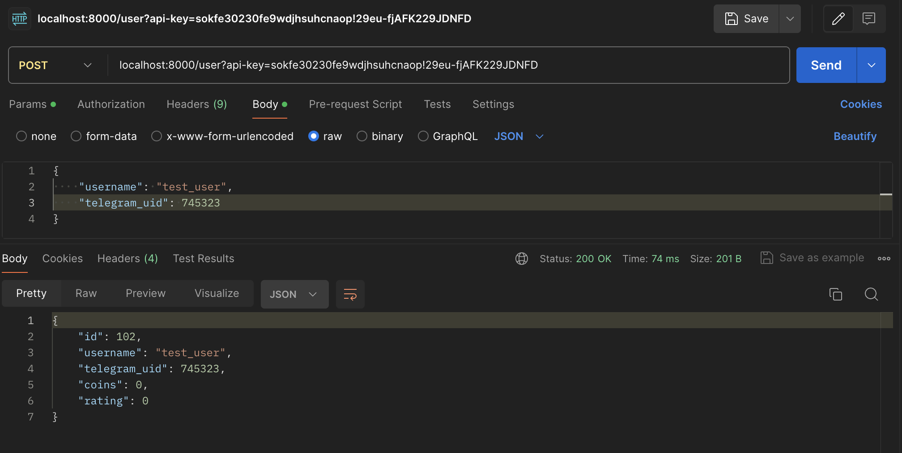
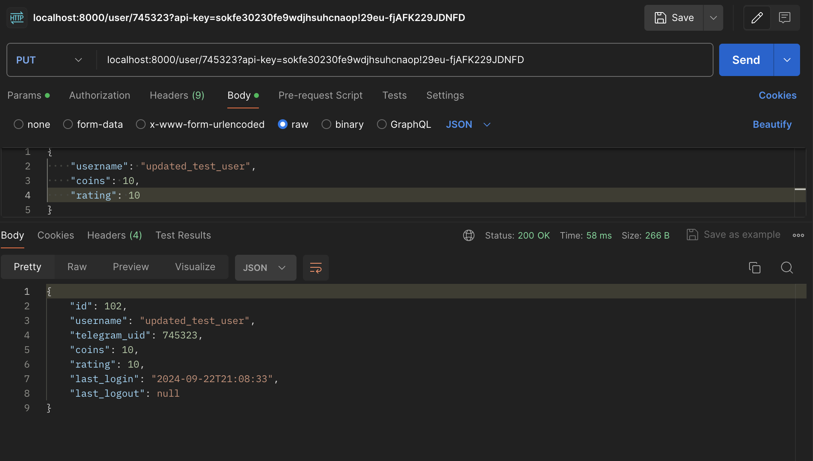

# tap_game

### Для успешного разворачивания при локальной разработке:
1. На основе .env.example создать и заполнить значениями .env файл в корневой директории репозитория
2. Собрать и запустить docker-контейнер командой в терминале
   </br>
    ```docker compose up -d --build```
3. Накатить миграции
   </br>
   ```docker compose exec -it app alembic upgrade head```
4. Сделать посев (создать 100 тестовых пользователей)
   </br>
   ```docker compose exec -it app python seed.py```

### Бот для админа: [здесь](https://t.me/cr_user_admin_bot)

### Production bot: [здесь](https://t.me/cr_prod_bot)

## Примеры запросов к API   
1. Получение списка всех пользователей</br>

2. Получение конкретного пользователя по username

3. Создание нового пользователя

4. Редактирование существующего пользователя по telegram_uid

